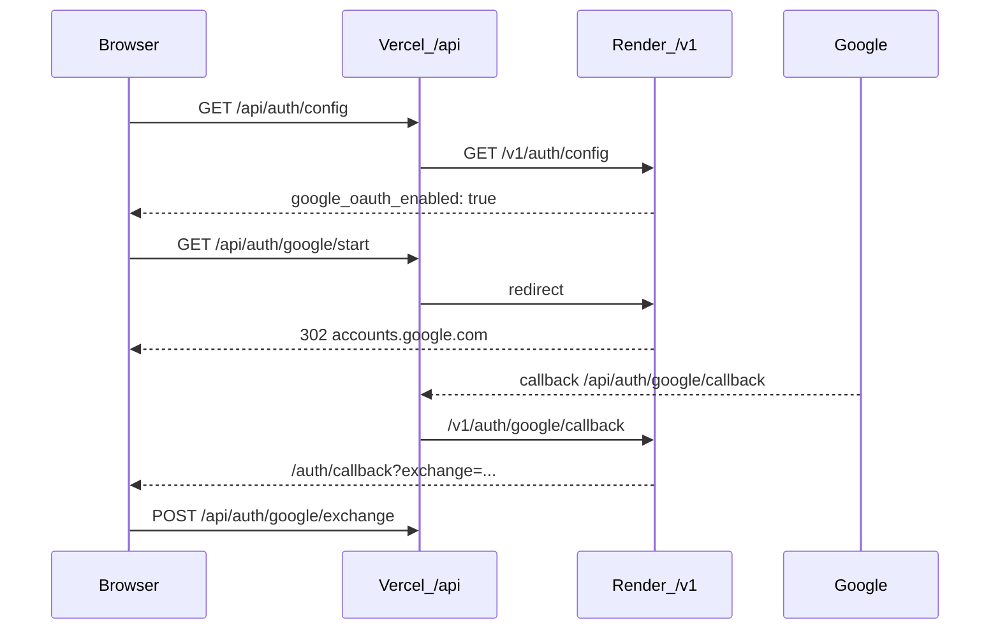

# Google OAuth (вход на сайт)

Вход через Google уже реализован в `app/services/google_oauth.py` и `app/routers/auth.py`. Фронт показывает кнопку «Продолжить с Google», когда `GET /v1/auth/config` возвращает `google_oauth_enabled: true` (или задан `VITE_GOOGLE_AUTH_ENABLED=true` на Vercel).

**Не путать** с коннектором Gmail (`GOOGLE_CONNECTOR_*`) — это отдельный OAuth для Nexus Connectors.

## Схема redirect (прод)



Прокси редиректов: `frontend/api/index.js` (Vercel serverless → Render).

Локально: Vite proxy `/api` → `http://127.0.0.1:8080/v1` (`frontend/vite.config.js`).

## Чеклист Render (nexus-cloud-server)

| Переменная | Значение (прод) |
|------------|-----------------|
| `GOOGLE_CLIENT_ID` | OAuth 2.0 Client ID из Google Cloud |
| `GOOGLE_CLIENT_SECRET` | секрет клиента |
| `GOOGLE_REDIRECT_URI` | `https://frontend-henna-tau-19.vercel.app/api/auth/google/callback` |
| `NEXUS_FRONTEND_URL` | `https://frontend-henna-tau-19.vercel.app` |
| `NEXUS_CLOUD_SECRET_KEY` | стабильный ключ (JWT state + exchange codes) |

После изменения env на Render — **Manual Deploy** или дождаться redeploy.

Проверка:

```bash
curl -s https://nexus-cloud-ee17.onrender.com/v1/auth/config
```

Ожидается JSON с `google_oauth_enabled: true` и `google_redirect_uri_configured` с URL Vercel `/api/auth/google/callback`.

## Чеклист Google Cloud Console

[APIs & Services → Credentials](https://console.cloud.google.com/apis/credentials) → OAuth 2.0 Client (Web application).

**Authorized redirect URIs** (оба при локальной разработке):

- `https://frontend-henna-tau-19.vercel.app/api/auth/google/callback` — прод
- `http://localhost:5173/api/auth/google/callback` — локально (через Vite proxy)

**OAuth consent screen:**

- Статус **Testing** — добавьте Gmail тестовых пользователей, иначе после клика будет `access_denied`.
- Для публичного сайта — позже **Publish app**.

## Локальная разработка

1. Cloud API: `cd nexus-cloud-server && uvicorn app.main:app --host 0.0.0.0 --port 8080`
2. Frontend: `cd frontend && npm run dev` (порт 5173)
3. В `nexus-cloud-server/.env` (не коммитить):

```env
GOOGLE_CLIENT_ID=...
GOOGLE_CLIENT_SECRET=...
GOOGLE_REDIRECT_URI=http://localhost:5173/api/auth/google/callback
NEXUS_FRONTEND_URL=http://localhost:5173
NEXUS_CLOUD_SECRET_KEY=...
```

Тот же OAuth client в Google Console должен включать redirect `http://localhost:5173/api/auth/google/callback`.

## Фронт: запасной флаг

На Vercel в `vercel.json` или Dashboard:

```env
VITE_GOOGLE_AUTH_ENABLED=true
```

Кнопка появится, даже если первый запрос `/auth/config` упал (cold start Render). Полный OAuth всё равно требует корректных ключей на Render.

## Ошибки на `/auth/callback`

См. `frontend/src/pages/AuthCallbackPage.jsx`: `oauth_redirect`, `access_denied`, `exchange_expired` — обычно неверный redirect URI в Console, test user не добавлен, или `NEXUS_CLOUD_SECRET_KEY` сменился между start и exchange.
